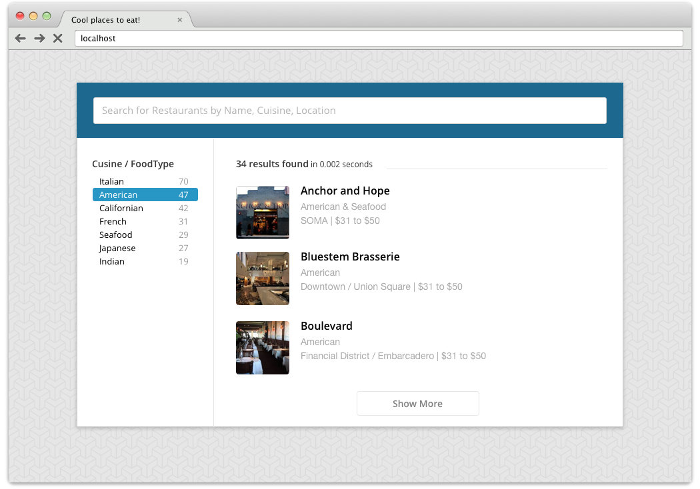
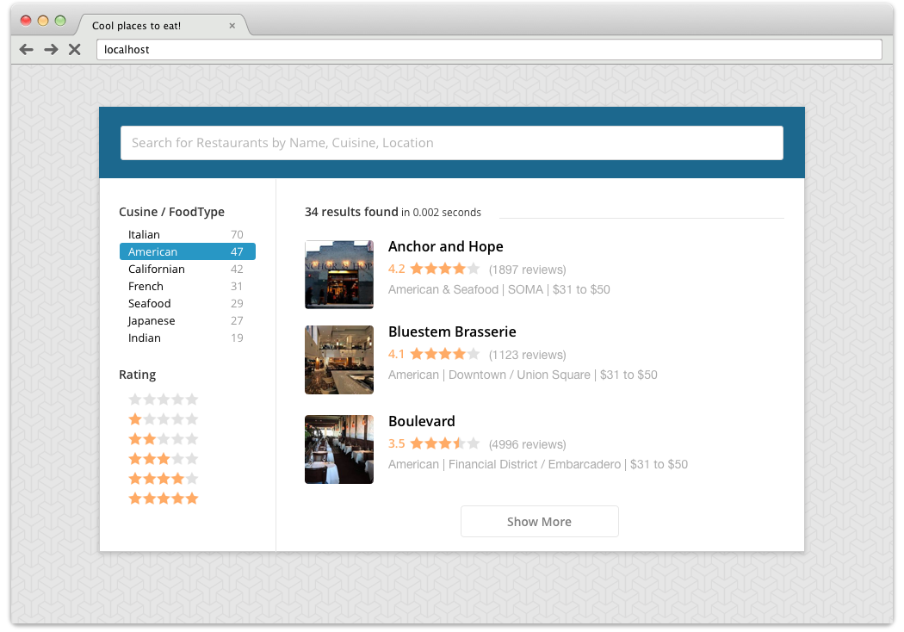

#  CSE Test - Place2Eat

Our sales team has recently been contacted by a large restaurant reservation website, for who it as identified as strategic to build a demo. As a Customer Solutions Engineer, you're asked to build a small prototype that, using the dataset and UI they have provided us, highlights the benefits of a great search experience.

## Instructions:

* Push the provided dataset to an Algolia index
* Produce the HTML markup and CSS needed to reproduce the UI provided by the client. To do so, you can write with vanilla CSS or a processor of your choice. We've provided configs for Sass and LESS.
* Using the Algolia JS Helper ([documentation](https://www.algolia.com/doc/guides/search/instant-search/algoliahelperjs)), implement an as-you-type search experience that enables users to easily find restaurants: both by passing a search query and/or filtering on the "type of cuisine".

*Screenshot of the demo once completed*

**Important Notes**

* Graphical resources, including the Sketch mockup, are provided in the `./resources` folder
* The dataset given by the client is available in the `./resources/dataset` folder. They have been able to extract 5000 restaurants from their database: `restaurants_list.json`. Unfortunately, because of some system complexity on their side, they haven't been able to provide everything in one file only. They sent us another file called `restaurants_info.csv` that contains additional information for all the extracted restaurants.
	* You'll need to manipulate both data files in order to have access to the "type of cuisine".
* The project is already all setup for you, if you're using Sass, LESS you shouldn't have to configure anything
	* Run `npm install` to download the dependencies
	* Then run `npm run dev` to create a server, and automatically refresh the page every time on of the `*.scss`, `*.less`, `*.html` files get updated.
	* Or run `npm run server` if you only want to run the server
* Feel free to use any front-end tooling with which you're the most confortable.
* The blue highlight in the sidebar is an active / over state.

### Bonus
If you have time, feel free to add a star-based rating in the search results, and eventually in the sidebar.

# Evaluation criteria:
The goal of this test is to evaluate your ability to build a front-end implementation using Algolia.

**Criterion**

* Overall look'n'feel of the demo: relevance, UI & UX
* Quality of the code: legibility and re-usability
* Attention given to details

# Deliverable:
Once you're happy with what you've done 

* Create a Github public repository to host the code *(including the import script if you have one)*
* Publish it using GitHub's gh-pages so we can interact with it

Happy coding!

**Note:** 
The provided dataset has been created using https://github.com/sosedoff/opentable project.
